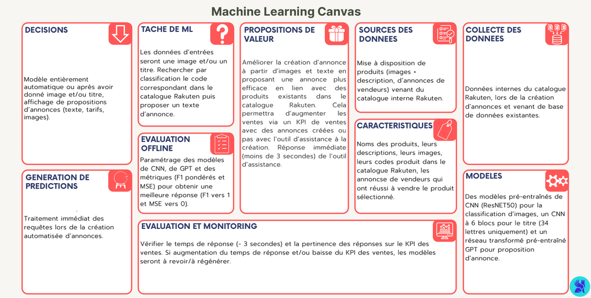

## Contexte et objectifs du projet
    Ce projet vise à construire un modèle de classification automatique de descriptions textuelles de produits afin de prédire leur catégorie.
    L’objectif est de fournir une pipeline reproductible, un modèle évalué, et une API d’inférence minimale prête à être déployée.

    Les descriptions produits sont transformées en représentations numériques à l’aide de TFIDF, puis classifiées via trois modèles :
        - Logistic Regression (baseline)
        - SVM
        - XGBoost

### Objectifs techniques
    Construire un modèle baseline robuste pour la classification de texte
    Comparer plusieurs modèles (SVM vs XGBoost)
    Garantir la reproductibilité des résultats
    Mettre à disposition une API d’inférence conteneurisée

### Objectifs MLOps
    Séparer clairement data / features / modèles
    Implémenter des tests unitaires (données, features, prédictions)
    Fournir une traçabilité des données et des modèles
    Déployer une API simple avec FastAPI + Docker


## Machine learning Canvas
    


## KPIs (performance, coût et latence)

    | KPI                    | Valeur            |
    | -----------------------| ------------------|
    | F1 macro               | Baseline ≥ 0.60   |
    | Latence inférence      | < 50 ms           |
    | Taille modèle          | SVM < 50 MB       |
    | Couverture vocabulaire | TF-IDF 2k        |

## Architecture du projet

### Architecture globale

    [Raw Data]
        ↓
    [Preprocessing]
        ↓
    [TF-IDF Vectorization]
        ↓
    [Model Training (Logistic Regression / SVM / XGBoost)]
        ↓
    [Evaluation & Selection]
        ↓
    [Model Artifact]
        ↓
    [FastAPI]
        ↓
    [Client]

### Workflow

    Notebook (EDA / baseline)
            ↓
    Python scripts (train, test)
            ↓
    Docker build
            ↓
    API d’inférence

### Structure du projet 
```
    ml-project/
    │
    ├── data/
    │   ├── raw/                    # données brutes
    │   ├── processed/              # données nettoyées
    │   └── data_quality_report.md
    │
    ├── notebooks/
    │   └── baseline_model.ipynb
    │
    ├── src/
    │   ├── preprocessing.py        # nettoyage texte
    │   ├── model.py                # pipelines ML
    │   ├── evaluate.py             # métriques
    │   └── train.py                # script d’entraînement
    │
    ├── api/
    │   └── main.py                 # API FastAPI
    │
    ├── tests/
    │   ├── test_data.py
    │   ├── test_features.py
    │   └── test_predictions.py
    │
    ├── models/
    │   └── model.pkl
    │
    ├── Dockerfile
    ├── Makefile
    ├── requirements.txt
    └── README.md
```

## Traitement des données
    Le traitement des données consiste à :
        - la collecte des données recupérées directement depuis le site Rakuten Challenge ( descritpions, titres et labels)
        - le nettoyage des données afin de les utiliser pour nos modèles par la suite (passage en minuscules, suppression des caractères spéciaux, encodage des labels)

    Les données utilisées pour la classification ont été filtrées à partir des données initiales pour les répartir dans 8 catégories différentes.


## Modèles de machine learning
    Pour la classification des titres+descriptions selon la catégorie on a utilisé les modèles suivants dans la phase précédante : 
        - Logistic Regression + TFIDF
        - SVM + TFIDF
        - XGBOOST + TFIDF


## Tests unitaires
    Les tests garantissent la stabilité des données, des features et des prédictions avant déploiement.

## API d'inférence
    On utilise FastAPI.
    Un chargement du modèle est attendu lorsqu'un call API est effectué pour une prédiction en temps réel (inférence en temps réel)


