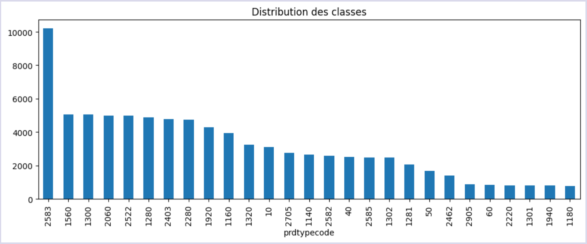
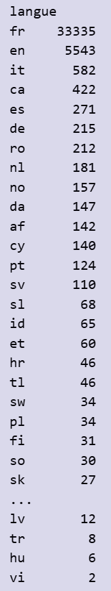
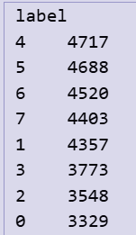
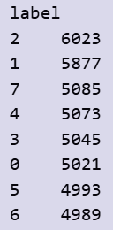

## Rapport des données brutes

### Infos sur les données manquantes et le type des données
RangeIndex: 84916 entries, 0 to 84915
Data columns (total 5 columns):
| Column      | non-null values | Data type 
|-------------|-----------------|-----------
| designation | 84916 non-null  | object
| description | 55116 non-null  | object
| productid   | 84916 non-null  | int64 
| imageid     | 84916 non-null  | int64 
| prdtypecode | 84916 non-null  | int64 

memory usage: 3.2+ MB

### Répartition initiale des classes

## Rapport des données après réequilibrage des classes

### Répartition des descriptions en français

### Répartition des descriptions toutes langues confondues

### Décision 
Suite à cette analyse, on constate que deux langues ressortent le plus : le français et l'anglais.
Si on décide de garder que les textes en français, on a un rapport entre la classe majoritaire et la classe minoritaire de 1.42.
Cela ne représente pas un gros désequibre de classes, en revanche on accepte de réduire notre jeu de données.
Si on décide de garder tous les textes, on a un rapport entre la classe majoritaire et la classe minoritaire de 1.21: ici le désequibre n'est pas significatif.

> Nous allons traduire les autres descriptions dans la langue majoritaire : le français.

## Source des données
- Origine : Rakuten Challenge, fichiers CSV
- Date d’extraction : 10/2024
- Nombre de lignes : 84 916

## Actions
- Concatenation des features et des labels en un seul dataset
- Suppression des eventuels doublons
- Remplacement des valeurs nan dans description par des ''
- Fusion des colonnes descriptions et designations
- Nettoyage des balises html
- Mise en forme en 'lowercase'
- Réequilibrage des classes
- Encodage des labels
- traduction des descriptions non françaises
